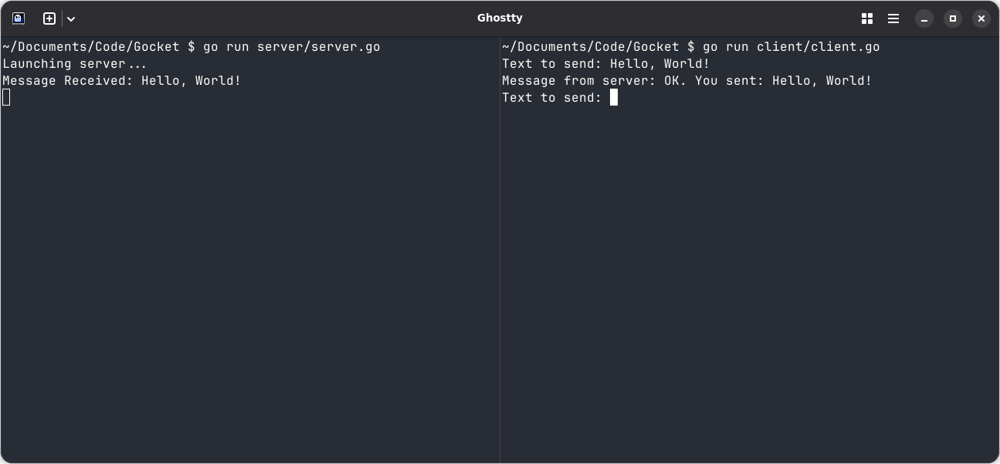

# Gocket 🚀

Welcome to Gocket! This project provides a clear and simple example of socket programming in Go. It features a basic TCP server and a corresponding client, demonstrating the fundamentals of network communication using Go's powerful standard library.



## Directory Structure

The project is organized into two main parts: the server and the client.

```
gocket/
├── server/
│   └── server.go
└── client/
    └── client.go
```

## Getting Started

### 1. Clone the Repository

First, clone the project from GitHub to your local machine. Open your terminal and run the following command:

```bash
git clone https://github.com/cyprienbf/Gocket.git
cd Gocket
```

### 2. Prerequisites

Ensure you have Go installed on your system. You can download it from the [official Go website](https://golang.org/dl/).

To check if Go is installed, run:
```bash
go version
```

## How to Compile

You can compile both the server and the client into executable files. Navigate to each directory and use the `go build` command.

**Compile the server:**
```bash
cd server
go build -o gocket-server
```

**Compile the client:**
```bash
cd ../client
go build -o gocket-client
```

This will create `gocket-server` and `gocket-client` executables in their respective directories.

## How to Use

You can run the programs directly using `go run` or by executing the compiled binaries.

### 1. Running the Gocket Client & Server

First, start the server, then connect to it with the client.

**Terminal 1: Start the Server**
Navigate to the `server` directory and run:
```bash
# Using go run
go run server.go

# Or run the compiled binary
./gocket-server
```
The server will print a startup message and wait for connections:
```
Launching server...
```

**Terminal 2: Start the Client**
Navigate to the `client` directory and run:
```bash
# Using go run
go run client.go

# Or run the compiled binary
./gocket-client
```
The client will prompt you for input.

**Example Interaction:**
1.  In the client terminal, type your message and press `Enter`.
    ```
    Text to send: Hello, World!
    ```
2.  The server will receive the message and send a confirmation back.
3.  The client will print the server's response:
    ```
    Message from server: OK. You sent: Hello, World!
    Text to send:
    ```

### 2. Testing the Server with `netcat`

You can use `netcat` (or `nc`) to act as a client and test the server.

**Terminal 1: Start the Server**
```bash
go run server/server.go
```

**Terminal 2: Connect with `netcat`**
```bash
nc localhost 8080
```
Now, you can type messages directly in the terminal.
```
Hello from netcat!  <-- You type this and press Enter
OK. You sent: Hello from netcat!  <-- Server's response
```

### 3. Testing the Server with `telnet`

`telnet` is another useful tool for testing TCP servers.

**Terminal 1: Start the Server**
```bash
go run server/server.go
```

**Terminal 2: Connect with `telnet`**
```bash
telnet localhost 8080
```
After connecting, type your message and press `Enter`.
```
Trying 127.0.0.1...
Connected to localhost.
Escape character is '^]'.
Hello from telnet!  <-- You type this and press Enter
OK. You sent: Hello from telnet!  <-- Server's response
```

## License

This project is licensed under the MIT License. See the `LICENSE` file for details.
